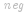
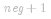

#### 方法一：直接排序

**思路与算法**

最简单的方法就是将数组 *A* 中的数平方后直接排序。

**代码**

```C++ [sol1-C++]
class Solution {
public:
    vector<int> sortedSquares(vector<int>& A) {
        vector<int> ans;
        for (int num: A) {
            ans.push_back(num * num);
        }
        sort(ans.begin(), ans.end());
        return ans;
    }
};
```

```Java [sol1-Java]
class Solution {
    public int[] sortedSquares(int[] A) {
        int[] ans = new int[A.length];
        for (int i = 0; i < A.length; ++i) {
            ans[i] = A[i] * A[i];
        }
        Arrays.sort(ans);
        return ans;
    }
}
```

```Python [sol1-Python3]
class Solution:
    def sortedSquares(self, A: List[int]) -> List[int]:
        return sorted(num * num for num in A)
```

```Golang [sol1-Golang]
func sortedSquares(a []int) []int {
    ans := make([]int, len(a))
    for i, v := range a {
        ans[i] = v * v
    }
    sort.Ints(ans)
    return ans
}
```

```C [sol1-C]

int cmp(const void* _a, const void* _b) {
    int a = *(int*)_a, b = *(int*)_b;
    return a - b;
}

int* sortedSquares(int* A, int ASize, int* returnSize) {
    (*returnSize) = ASize;
    int* ans = malloc(sizeof(int) * ASize);
    for (int i = 0; i < ASize; ++i) {
        ans[i] = A[i] * A[i];
    }
    qsort(ans, ASize, sizeof(int), cmp);
    return ans;
}
```

**复杂度分析**

- 时间复杂度： ，其中 *n* 是数组 *A* 的长度。

- 空间复杂度： 。除了存储答案的数组以外，我们需要   的栈空间进行排序。

#### 方法二：双指针

**思路与算法**

方法一没有利用「数组 *A* 已经按照升序排序」这个条件。显然，如果数组 *A* 中的所有数都是非负数，那么将每个数平方后，数组仍然保持升序；如果数组 *A* 中的所有数都是负数，那么将每个数平方后，数组会保持降序。

这样一来，如果我们能够找到数组 *A* 中负数与非负数的分界线，那么就可以用类似「归并排序」的方法了。具体地，我们设   为数组 *A* 中负数与非负数的分界线，也就是说，*A[0]* 到 ![A\[\textit{neg}\] ](./p__A_textit{neg}__.png)  均为负数，而 ![A\[\textit{neg}+1\] ](./p__A_textit{neg}+1__.png)  到 *A[n-1]* 均为非负数。当我们将数组 *A* 中的数平方后，那么 *A[0]* 到 ![A\[\textit{neg}\] ](./p__A_textit{neg}__.png)  单调递减，![A\[\textit{neg}+1\] ](./p__A_textit{neg}+1__.png)  到 *A[n-1]* 单调递增。

由于我们得到了两个已经有序的子数组，因此就可以使用归并的方法进行排序了。具体地，使用两个指针分别指向位置   和  ，每次比较两个指针对应的数，选择较小的那个放入答案并移动指针。当某一指针移至边界时，将另一指针还未遍历到的数依次放入答案。

**代码**

```C++ [sol2-C++]
class Solution {
public:
    vector<int> sortedSquares(vector<int>& A) {
        int n = A.size();
        int negative = -1;
        for (int i = 0; i < n; ++i) {
            if (A[i] < 0) {
                negative = i;
            } else {
                break;
            }
        }

        vector<int> ans;
        int i = negative, j = negative + 1;
        while (i >= 0 || j < n) {
            if (i < 0) {
                ans.push_back(A[j] * A[j]);
                ++j;
            }
            else if (j == n) {
                ans.push_back(A[i] * A[i]);
                --i;
            }
            else if (A[i] * A[i] < A[j] * A[j]) {
                ans.push_back(A[i] * A[i]);
                --i;
            }
            else {
                ans.push_back(A[j] * A[j]);
                ++j;
            }
        }

        return ans;
    }
};
```

```Java [sol2-Java]
class Solution {
    public int[] sortedSquares(int[] A) {
        int n = A.length;
        int negative = -1;
        for (int i = 0; i < n; ++i) {
            if (A[i] < 0) {
                negative = i;
            } else {
                break;
            }
        }

        int[] ans = new int[n];
        int index = 0, i = negative, j = negative + 1;
        while (i >= 0 || j < n) {
            if (i < 0) {
                ans[index] = A[j] * A[j];
                ++j;
            } else if (j == n) {
                ans[index] = A[i] * A[i];
                --i;
            } else if (A[i] * A[i] < A[j] * A[j]) {
                ans[index] = A[i] * A[i];
                --i;
            } else {
                ans[index] = A[j] * A[j];
                ++j;
            }
            ++index;
        }

        return ans;
    }
}
```

```Python [sol2-Python3]
class Solution:
    def sortedSquares(self, A: List[int]) -> List[int]:
        n = len(A)
        negative = -1
        for i, num in enumerate(A):
            if num < 0:
                negative = i
            else:
                break

        ans = list()
        i, j = negative, negative + 1
        while i >= 0 or j < n:
            if i < 0:
                ans.append(A[j] * A[j])
                j += 1
            elif j == n:
                ans.append(A[i] * A[i])
                i -= 1
            elif A[i] * A[i] < A[j] * A[j]:
                ans.append(A[i] * A[i])
                i -= 1
            else:
                ans.append(A[j] * A[j])
                j += 1

        return ans
```

```Golang [sol2-Golang]
func sortedSquares(a []int) []int {
    n := len(a)
    lastNegIndex := -1
    for i := 0; i < n && a[i] < 0; i++ {
        lastNegIndex = i
    }

    ans := make([]int, 0, n)
    for i, j := lastNegIndex, lastNegIndex+1; i >= 0 || j < n; {
        if i < 0 {
            ans = append(ans, a[j]*a[j])
            j++
        } else if j == n {
            ans = append(ans, a[i]*a[i])
            i--
        } else if a[i]*a[i] < a[j]*a[j] {
            ans = append(ans, a[i]*a[i])
            i--
        } else {
            ans = append(ans, a[j]*a[j])
            j++
        }
    }

    return ans
}
```

```C [sol2-C]
int* sortedSquares(int* A, int ASize, int* returnSize) {
    int negative = -1;
    for (int i = 0; i < ASize; ++i) {
        if (A[i] < 0) {
            negative = i;
        } else {
            break;
        }
    }

    int* ans = malloc(sizeof(int) * ASize);
    *returnSize = 0;
    int i = negative, j = negative + 1;
    while (i >= 0 || j < ASize) {
        if (i < 0) {
            ans[(*returnSize)++] = A[j] * A[j];
            ++j;
        } else if (j == ASize) {
            ans[(*returnSize)++] = A[i] * A[i];
            --i;
        } else if (A[i] * A[i] < A[j] * A[j]) {
            ans[(*returnSize)++] = A[i] * A[i];
            --i;
        } else {
            ans[(*returnSize)++] = A[j] * A[j];
            ++j;
        }
    }

    return ans;
}
```

**复杂度分析**

- 时间复杂度：*O(n)*，其中 *n* 是数组 *A* 的长度。

- 空间复杂度：*O(1)*。

#### 方法三：双指针

**思路与算法**

同样地，我们可以使用两个指针分别指向位置 *0* 和 *n-1*，每次比较两个指针对应的数，选择较大的那个**逆序**放入答案并移动指针。这种方法无需处理某一指针移动至边界的情况，读者可以仔细思考其精髓所在。

**代码**

```C++ [sol3-C++]
class Solution {
public:
    vector<int> sortedSquares(vector<int>& A) {
        int n = A.size();
        vector<int> ans(n);
        for (int i = 0, j = n - 1, pos = n - 1; i <= j;) {
            if (A[i] * A[i] > A[j] * A[j]) {
                ans[pos] = A[i] * A[i];
                ++i;
            }
            else {
                ans[pos] = A[j] * A[j];
                --j;
            }
            --pos;
        }
        return ans;
    }
};
```

```Java [sol3-Java]
class Solution {
    public int[] sortedSquares(int[] A) {
        int n = A.length;
        int[] ans = new int[n];
        for (int i = 0, j = n - 1, pos = n - 1; i <= j;) {
            if (A[i] * A[i] > A[j] * A[j]) {
                ans[pos] = A[i] * A[i];
                ++i;
            } else {
                ans[pos] = A[j] * A[j];
                --j;
            }
            --pos;
        }
        return ans;
    }
}
```

```Python [sol3-Python3]
class Solution:
    def sortedSquares(self, A: List[int]) -> List[int]:
        n = len(A)
        ans = [0] * n
        
        i, j, pos = 0, n - 1, n - 1
        while i <= j:
            if A[i] * A[i] > A[j] * A[j]:
                ans[pos] = A[i] * A[i]
                i += 1
            else:
                ans[pos] = A[j] * A[j]
                j -= 1
            pos -= 1
        
        return ans
```

```Golang [sol3-Golang]
func sortedSquares(a []int) []int {
    n := len(a)
    ans := make([]int, n)
    i, j := 0, n-1
    for pos := n - 1; pos >= 0; pos-- {
        if v, w := a[i]*a[i], a[j]*a[j]; v > w {
            ans[pos] = v
            i++
        } else {
            ans[pos] = w
            j--
        }
    }
    return ans
}
```

```C [sol3-C]
int* sortedSquares(int* A, int ASize, int* returnSize) {
    int* ans = malloc(sizeof(int) * ASize);
    *returnSize = ASize;
    for (int i = 0, j = ASize - 1, pos = ASize - 1; i <= j;) {
        if (A[i] * A[i] > A[j] * A[j]) {
            ans[pos] = A[i] * A[i];
            ++i;
        } else {
            ans[pos] = A[j] * A[j];
            --j;
        }
        --pos;
    }
    return ans;
}
```

**复杂度分析**

- 时间复杂度：*O(n)*，其中 *n* 是数组 *A* 的长度。

- 空间复杂度：*O(1)*。